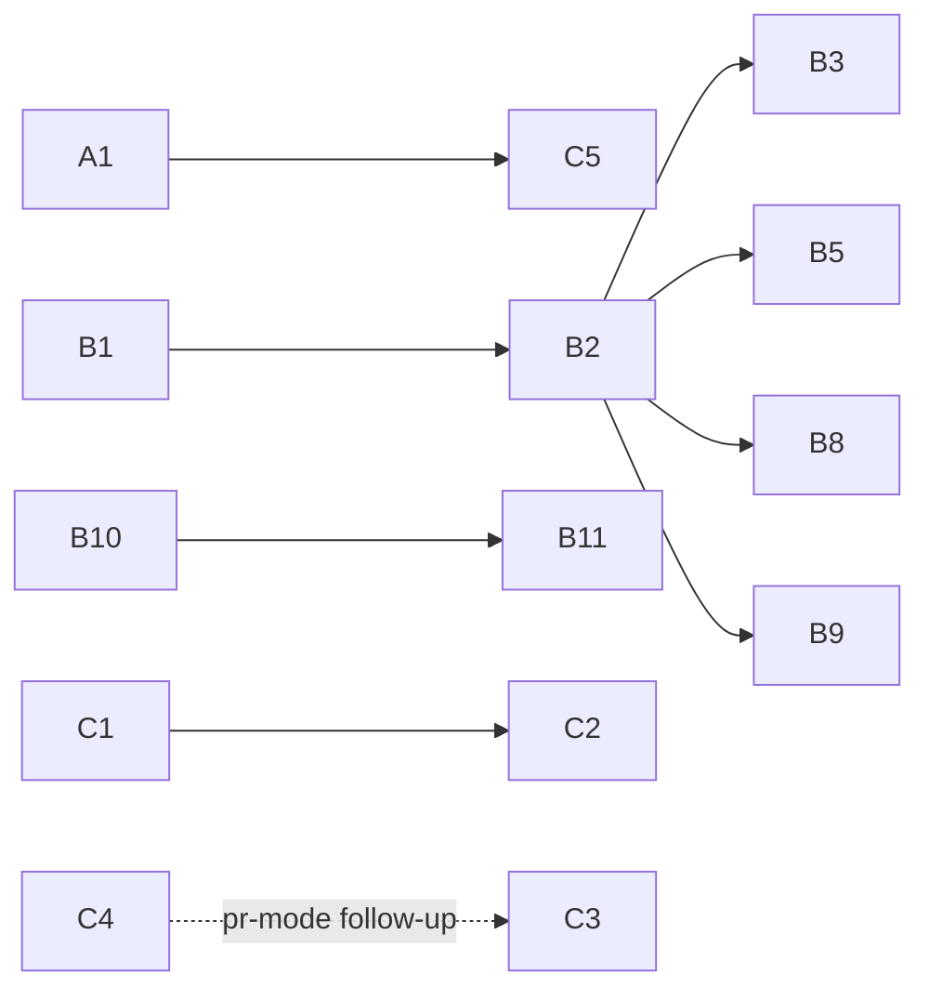

# Ticket program: strategic-review remediation (draft for operator review)

*2026-08-17. Derived from docs/2026-08-16-rk-strategic-review.md plus the operator-ratified decisions of 2026-08-17: freeze list (incl. adapter verdicts from the 801-spawn usage audit), recovery cap values, and the R5 resolution (pluggable notification sinks, herdr first). Tickets are referenced symbolically (A1, B2, …) — real ids are assigned by `rk ticket new` at filing time; never pre-guess ids.*

Global acceptance criteria applying to every recovery-behavior ticket (B-wave):

- **Announce mode**: every automated recovery action emits an event tuple + inbox row before/as it acts. Silence is earned later, not shipped now.
- **Rate caps and jitter**: every sweep-driven action is rate-capped per the ratified numbers and jittered ±10%.
- **Numbers are the ratified ones** — restated per ticket below; do not re-derive.

---

## Wave A — protect the backlog, honor the freeze (file first)

**A1. Generator constraints: freeze tags + drain/self-improve exclusion (R6)** — *medium, no deps, land before the rest of this program is filed*
Add a `frozen` subsystem tag vocabulary (factory-foreman, product-to-code, onboarding-wizard, jcode-adapter, ballots). Drain and the nightly self-improve schedule must not claim tickets tagged frozen; backlog groom pass tags existing open tickets touching frozen subsystems. Onboarding carve-out: tickets extracting its read-only enforcement machinery for the diagnostician role (E1) are *not* frozen — tag convention must express this (e.g. `frozen-except:extraction`).
*AC: a frozen-tagged ready ticket is never dispatched by drain or scheduler-driven self-improve; carve-out tickets are; existing backlog groomed and tagged.*

**A2. Delete the axe adapter** — *small, no deps*
Zero uses in 801 lifetime spawns. Remove crate/module, config surface, and docs references.
*AC: workspace builds; no `axe` references outside CHANGELOG/history.*

**A3. Approval-boundary smoke workflow** — *small, no deps, files WITH the freeze not after*
A scheduled (weekly) workflow that drives `action_approval.rs` through propose → digest → approve → daemon-execute with CAS, against a no-op action, and escalates on failure. This is the freeze's only "keep exercised" obligation; an unexercised security gate is the TKT-171 pattern.
*AC: workflow exists, runs green on schedule, red path produces an escalation notice.*

*(Dead steward CUE deletion: already ticketed as TKT-01M048 — referenced, not duplicated.)*

---

## Wave B — recovery substrate (S1 + S2 + R5 sink)

**B1. NotificationSink extraction (R5 core)** — *medium, no deps, gates B2*
Extract the hardwired path (`reactor.rs` `notify_escalation` → `rk_mux::HerdrMux::notify`) into: `EscalationNotice` (tuple_id, class, severity, scope, subject, text, suggested action, structured refs), `NotificationSink` trait, config-driven `[[notify.sinks]]` registry with class/severity filters, and ONE fan-out function used by all escalation sources. Herdr sink reproduces current behavior exactly; existing `notify_escalations` bool maps onto it for back-compat. Sinks are best-effort: a deliver failure logs and never blocks escalation recording. Per-(tuple, sink) durable dedup reusing the `already_fired` marker pattern.
*AC: existing steward-escalation notification behavior unchanged under default config; second sink can be registered in config without code changes to callers; dead sink degrades to passive inbox.*

**B2. Recovery announce helper + ack + re-notify sweep** — *medium, deps: B1*
(a) Shared helper for recovery actions: emit event tuple + inbox row + fan-out through B1, with per-action rate-cap and ±10% jitter support. (b) `rk inbox ack <id>` writes a durable tuplespace ack marker. (c) Re-notify sweep: escalation with no ack → re-notify at 4h, then every 24h, max 3, then a standing inbox row with no further pushes. Ack is sink-agnostic — a future rat-king sink acks through the same CLI path.
*AC: unacked escalation re-notifies on the 4h/24h/max-3 schedule; acked one never re-notifies; helper used by B3/B5/B8/B9.*

**B3. Enable auto-respawn with ratified caps** — *small, deps: B2*
`respawn_enabled = true`; keep `respawn_max_attempts = 3`; raise `respawn_backoff_secs` 60 → 300 (attempts span ~15min so a systemic failure doesn't exhaust them in 3); **new knob**: castle-wide respawn rate cap 10/hour (200 of 786 archived rats failed, often in correlated incidents — per-agent caps don't cover a fleet-wide event). Each respawn announces via B2.
*AC: crashed/orphaned rat respawns ≤3× with 300s-base exponential backoff; 11th castle-wide respawn in an hour is held and escalated instead; every respawn announced.*

**B4. Promote burn threshold to shipped default + comment drift fix** — *small, no deps*
`burn_usd_per_min` default 0.0 → 4.0 (normal rats p99 $1.24/min lifetime-average, observed runaways ~$7/min sustained). Fix config.toml comment drift: stuck detection default is 600s, comment says 900s.
*AC: fresh castle gets burn detection on at 4.0; existing override unaffected.*

**B5. Kill process group at `rk done` (seam 7)** — *small, deps: B2*
On completion, 60s grace then SIGKILL the harness process group. Closes post-completion runaway burn, which today evades even enabled burn detection because the sweep filters `is_live()`. Kill announced via B2.
*AC: a harness that lingers after `rk done` is dead ≤90s later; clean-exit path unaffected; transcript flush survives the grace window.*

**B6. Scheduler cursor pins on dispatch error (seam 3a)** — *small, no deps*
Copy the reactor's pattern (`reactor.rs:279-281`): on retryable dispatch failure, do not advance the cursor; the minute is retried, not dropped (`scheduler.rs:131-142`).
*AC: injected dispatch failure → same minute re-attempted next tick; success path advances as today; catchup_minutes bound still respected.*

**B7. Scheduler single-flight staleness bound (seam 3b)** — *small, no deps*
A schedule's `Running` instance older than **6h** no longer blocks dispatch (above rat p99 runtime ~5h, well below the 24h nightly cadence). Stale instance is surfaced, not silently ignored.
*AC: schedule with a wedged 7h-old instance fires on its next matching minute and escalates the stale instance.*

**B8. Stale-`Running`-instance hard timeout (seam 4)** — *small-medium, deps: B2*
Instance `Running` past **12h** wall-clock (per-workflow override allowed) → mark failed, finalize, escalate via B2. Targets the observed 6.4-day wedged outlier; >2× the slowest legitimate run observed.
*AC: artificially wedged instance transitions to failed at 12h with an escalation notice; long-running workflow with an explicit override is untouched.*

**B9. Reopen orphaned in-progress tickets (seam 5)** — *small, deps: B2*
Sweep: ticket `in_progress` with no live owning agent for **15min** → reopen (back to drain-eligible), announced. The 15min delay avoids racing spawn handoff and restart recovery.
*AC: ticket whose rat died reopens ≤16min later with an announce row; ticket with a live owner never touched.*

**B10. Version-stamped socket handshake (S2a)** — *small, no deps*
CLI↔daemon handshake carries build version (daemon already exposes it at `server.rs:5551`; nothing compares). On mismatch every CLI invocation warns loudly.
*AC: stale daemon + new CLI → visible warning naming both versions; matched versions silent.*

**B11. One-command rollover: drain → restart → reconcile (S2b)** — *medium, deps: B10*
`rk daemon rollover` (name TBD): stop accepting new dispatch, wait/park live rats, restart daemon binary, reconcile state (respawn via B3 handles orphans). Automatic self-restart stays behind a flag — `current_exe()` restart-loop on stale PATH binaries is a live hazard (mise/PATH gotcha). This removes the "every daemon improvement taxes the fleet" cost for the rest of the program.
*AC: rollover on a castle with 2 live rats loses no ticket state; orphaned rats respawn; mismatch warning from B10 suggests the command.*

---

## Wave C — structural (S3, S5) + R1 + R2 prerequisites

**C1. Generation identity — design (S3a)** — *small, no deps*
Design doc + type: spawn-time ULID (or `(name, generation)`) stamped into agent records and tuples; names demoted to display labels. Enumerate every name-joining consumer: `wait`/`wait_all`, completion claims, log keying, dismiss targeting, plus any found by audit.
*AC: reviewed design listing every consumer with its migration note; retires the TKT-136/146 class structurally.*

**C2. Generation identity — migrate consumers (S3b)** — *medium-large, deps: C1*
Migrate the enumerated consumers to join on the generation key; name-only matching removed or bounded. Checklist-per-consumer in the ticket body.
*AC: a fresh rat reusing a predecessor's name cannot match the predecessor's `harness_result` or be targeted by its trailing dismiss (regression test = the TKT-146 scenario).*

**C3. Bind ticket-done to delivery (S5, minus pr-mode)** — *medium, no deps*
`merge`/`merge-push`: done requires `merged == true`. `push-branch`: done requires the `remote_branch_merged_or_gone` ancestor-of-target check. pr-mode explicitly deferred until a forge-webhook ingest source exists (post-C4). Closes the TKT-18/46/147 "approved but never merged" class structurally.
*AC: `rk done` (or steward mark-done) on an unmerged merge-mode ticket is refused with a pointed error; merged path unaffected.*

**C4. Minimal ingest bridge (R1): GitHub Actions CI poller** — *medium, no deps*
Source: rat-kingdom's own CI (`ci.yml` on github.com/chazu/rat-kingdom — the only registered repo with a remote). First form is a **poller, not a webhook listener**: laptop-hosted daemon has no public endpoint, so a launchd shim polls the Actions API (~2min cadence) for recent run conclusions and translates them into `rk ingest` (`ci_failed`/`ci_recovered`), using a per-source derived rk token and a read-only fine-grained GitHub token over plain HTTPS (no `gh` CLI, consistent with the use-git-directly decision). `delivery_id = run_id + attempt` for dedup; transition detection suppresses unchanged-state refreshes. Read-only; exercises auth, dedup receipts, and transition detection against reality. Listener/webhook form is a later swap if ingest ever moves to a server castle (rk-sync is the kept path for that).
*AC: a real CI failure on main surfaces as a deduped `ci_failed` signal with correct transition semantics; re-poll of the same run/attempt is a no-op; recovery run emits `ci_recovered`; shim survives daemon and laptop restarts (launchd).*

**C5. Diagnostician read-only role (R2 prerequisite)** — *medium, deps: A1 (carve-out tag)*
Extract the onboarder forced read-only tool enforcement into a reusable worker role usable by workflow dispatch. This is the "read-only diagnosis workflow" actor that currently does not exist.
*AC: a diagnostician-role rat cannot write files, push, or execute state-changing rk commands; enforcement is the extracted machinery, not a new parallel implementation (anti-TKT-171).*

**C6. Payload hygiene for external text in prompts (R2 prerequisite)** — *small-medium, no deps*
Rules + helper for templating external text (alert annotations, webhook payloads) into rat prompts: fenced/escaped, provenance-marked, length-capped; trigger params from ingest sources pass through it. Prompt-injection surface named in the strategic review §4.
*AC: hostile alert annotation is rendered inert (fenced + marked) in a dispatched prompt; documented rule for future trigger authors.*

---

## DAG

Everything unlisted is independent. Suggested filing order: A-wave first (A1 before the rest of the program enters the backlog), then B1/B2 (the sink+announce spine), then remaining B in any order, then C. B11 early materially cheapens shipping every other daemon-side ticket.

## Filed ticket ids (2026-08-17, repo rat-kingdom, label `strategic-review`)

| Sym | Ticket | Sym | Ticket |
|---|---|---|---|
| A1 | TKT-01M08H9QN8W8765293YMQ532WB | B7 | TKT-01M08HB52YWQ5Z6AC4B52NCK6Q |
| A2 | TKT-01M08H9QNHF94V5KK4WV27Y46S | B8 | TKT-01M08HB53M1TYNW1ZZKBDPHNND |
| A3 | TKT-01M08H9QQPJGFS9ET25Q26YSDM | B9 | TKT-01M08HB54368PFTWJ4NME5FSJ2 |
| B1 | TKT-01M08H9QQXYZJA7X8DER9NTC87 | B10 | TKT-01M08HB54FE4WADB30KKBYXND5 |
| B2 | TKT-01M08HB4ZGTGNAQWYD6PNF9KCW | B11 | TKT-01M08HB5542DMTZJ27AEG9HEBS |
| B3 | TKT-01M08HB51R2C5YQCAT1GRCW8VJ | C1 | TKT-01M08HB55EJF86WPP57F2M6MJS |
| B4 | TKT-01M08HB520XBDSJKNC7A2QT2CJ | C2 | TKT-01M08HB55TDA8T3XNBH6F1DSHZ |
| B5 | TKT-01M08HB52798JZ6CKNSZF0BJ4A | C3 | TKT-01M08HB566GFBZVMDKZ8DT1ES0 |
| B6 | TKT-01M08HB52KW69VBQXT04DK7ZPH | C4 | TKT-01M08HB56NRQ72ZZ4W6JKQ760Y |
| C5 | TKT-01M08HB57164NCZCGHPB8KB690 | C6 | TKT-01M08HB57CQVJBYZ6J2HTV77E6 |

Dependency edges filed via `--depends-on`; verified with `rk ticket ready` (12 roots ready, 8 dependents blocked).

## Deferred (decision list, not tickets)

- **Alert valve opening** (relax `reactor.rs:248-263` per-repo): after C4 + C5 + C6 land, as a policy decision.
- **S4 reconciler beyond B8/B9**: grown against R2 live traffic; requires the arbitration decision (which of the nine loops it absorbs, so the count goes down).
- **rat-king sink**: revisit after 2–4 weeks of announce-mode escalation-volume data from B2.
- **S5 pr-mode done-binding**: after a forge webhook becomes the second ingest source.
- **R7 external actions** through the approval boundary: after the read-only loop has run long enough to trust.
