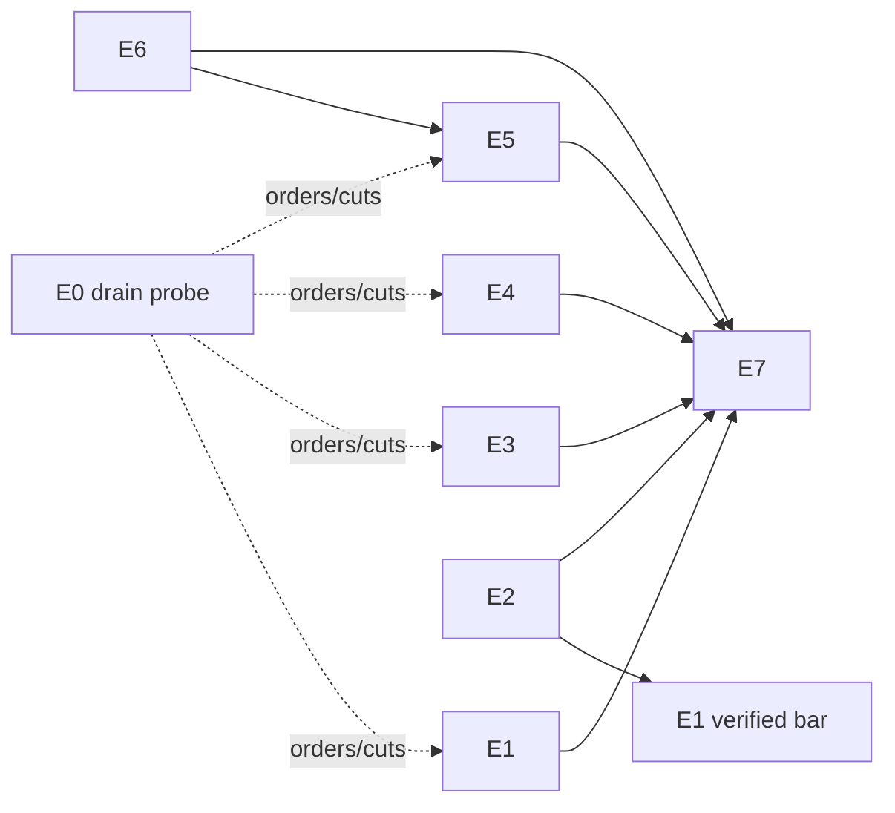

# Phase 2 epic: orchestration fixes (rev 2, post-adversarial-review)

*2026-08-18. Successor to docs/2026-08-17-rk-ticket-program.md. Rev 2
incorporates a four-lens adversarial review (design soundness against the
actual code, operational economics on the real 8-core box, strategic scope
against the 2026-08-16 review's own principles, and a mu/pudl fact-check).
38 findings; every blocker is addressed inline below and marked ⟨R⟩.
Companion doc: docs/2026-08-18-rk-mu-pudl-integration.md (demoted to a
feasibility spike by the same review).*

*Scope: runner-agnostic and self-contained — nothing here depends on mu.*

## Binding cross-cutting rules ⟨R⟩

These were phase-1 acceptance criteria that rev 1 silently dropped; they are
restated as binding on **every** automated action this epic adds:

1. **Announce + rate-cap + jitter** on every automated action (E2 retests,
   E3 auto-filed tickets, E4 lease actions). Silence is earned, not shipped.
2. **No new loop without absorption accounting**: any new background
   loop/sweep names which existing loop it absorbs or why none can be. A
   loop inventory with ownership map is an E7 entry criterion.
3. **`epic-wip` freeze tag**: gate, drain, readiness, and broker subsystems
   are excluded from nightly self-improve and drain claims for the epic's
   duration — the generators must not churn the substrate mid-rebuild.
4. **Operators are not a bypass** (see E2): every landing on a gated target
   goes through the gate, humans included.

---

## E0. The drain probe — run FIRST, before filing the rest ⟨R⟩

The review's sharpest strategic finding: this epic's premise ("drain-as-is
is not useful") was formed on a day when phase-1's fixes were still landing,
and rev 1 gated the only experiment that could check it behind ~20 tickets.

**E0 is a 2-day supervised mini-drain on TODAY'S machinery**: `max_wip 2`,
a groomed small-ticket backlog, C3's existing done-binding as the de facto
`merged` bar. Deliverable: interventions classified by cause. **The
intervention classes order (and may cut) E1–E5.** Costs nothing to build.
The rk-king decision input starts accumulating here, not after E7.

## E1. Delivery-aware readiness — corrected design ⟨R⟩

**Rev 1's predicate was unsound** (review blockers 1, 5, 6): it live-read
branch refs that landing deletes (`delivery.delete_source` defaults true) —
so a cleanly-landed ticket's bar read false forever; it was blind to
cherry-pick landings and read *satisfied* after `revert_merge`; bars could
satisfy late or regress with no dispatch wake-up or recall; and pr-mode
squash merges deadlocked the bar ladder.

**Corrected:**

- **Durable delivery record, not live refs.** At land time the pipeline (or
  dismiss, or the operator fast-lane) records `merge_commit` (or the
  cherry-pick/squash result SHA) **on the ticket**. The `merged` bar is
  `is_ancestor(recorded_commit, target)`. `rk revert` explicitly clears the
  record (bar-clearing is an event, never inferred).
- **Bar satisfaction is an event** that wakes drain/ready re-evaluation —
  late satisfaction (CI green arriving, a gate pass) must not strand
  dependents until an unrelated event. Bar *regression* (revert, late
  rollback signal) emits an obstacle naming any dependents dispatched under
  the old state; claims snapshot the bar state they were admitted under.
- **One receipt authority.** `verified` = the landing gate's pass tuple for
  a tree containing the work. **CI-via-ingest is advisory only — it never
  gates dispatch.** The review flagged that accepting ingest signals as
  dispatch authority silently promotes observe-only ingest tokens into a
  steering channel, breaking the strategic review's security model. For
  pr-mode repos (where the forge is the gate), `merged` is defined by forge
  merge facts / patch-id containment — the strict bar implication is broken
  for pr repos by design, not deadlocked.
- **The predicate REPLACES `is_done` in every dependency consumer** —
  `ready`, drain claim, `blockers`/`blocked_ids`, the done-event fan-out —
  and subsumes the done-gate's per-mode carve-outs. The review counted
  four coexisting "is it delivered" implementations post-rev-1; the epic
  retires them to one or it recreates TKT-171 while citing it.
- **Bars 3–4 (`released`, `deployed`, soak windows, per-edge overrides) are
  DEFERRED to the decision list** — zero observed incidents, no deployed
  tenant, pure grown-not-built violation. The ladder ships as
  `merged` | `verified`.

## E2. Merge queue — corrected design ⟨R⟩

**Rev 1 was unimplementable as cited and economically unexamined** (review
blockers): `Repo::merge_branch` always builds a fresh merge commit and
`advance_target` is private — the naive wiring lands a *never-tested* tree
with a green receipt; the dismiss path is a second uncoordinated writer
that defeats the queue on every workflow completion; operator hand-merges
(ten on 2026-08-17, including conflict resolutions) bypass everything; and
the full profile per landing ≈ 5 h/day of serialized compute on the 8-core
box — a hard ceiling of ~3 landings/hour.

**Corrected:**

- **New public CAS primitive** `advance_to(target, tested_commit,
  expected_parent)`. The gate merges (branch, target), tests THAT tree,
  and on pass advances the target to the tested commit. **Hard invariant,
  asserted in the receipt: landed SHA == tested SHA.**
- **One queue, no second writers.** Dismiss/`dismiss_all` merge-mode
  deliveries enqueue into the same landing queue. Operator landings get a
  **fast lane** (front of queue, same gate) — priority, not bypass.
- **Batching is the economics answer** (not mu, not retries): the gate may
  test N queued branches as one octopus/serial merge; on failure, bisect
  (test N/2). Amortizes the suite across the completion waves observed in
  practice. `landing.max_retest = 1`; **exhaustion requeues to tail**
  (announced), never a terminal hold on a green branch.
- **Warm gate cache**: the persistent per-(repo,target) gate worktree keeps
  a managed incremental `target/` dir; quarantine-and-rebuild it after any
  killed or failed check run (see E4) so corruption can't poison
  subsequent landings.
- **Canonical profile** `checks.canonical` + explicit `checks.runner:
  command` field, as rev 1. The profile is ONE list; runner is a per-check
  attribute — never two half-profiles.
- pr-mode repos defer to the forge's queue, as rev 1.

## E3. Structured chaining — corrected design ⟨R⟩

**Rev 1's "plumbing exists" was false**: `--base` sets the merge *target*
(supervisor.rs:908-911) — a rework spawned that way merges INTO the
reviewed branch, never reaches main, and reads as delivered. And auto-filed
continuations had no depth bound: a stuck rat becomes a $20-per-cycle
annuity with inherited priority.

**Corrected:**

- **Distinct `fork_point` spawn parameter** (branch or SHA), separate from
  the merge target, which stays the original target. Ticket fields:
  `rework_of`, `fork_point`, `findings`, `scope: findings-only`.
- **Validate `fork_point` at claim time**; if the branch was deleted
  (landing deletes sources), fall back to its recorded tip SHA (recorded
  in the ticket at filing).
- **Continuation depth cap = 2**, then escalate through sinks with the stop
  context. Auto-filed tickets (rework + continuation) are rate-capped per
  hour castle-wide and announced — a correlated budget-kill wave must not
  silently mass-file.
- Late-verdict convergence and priority inheritance as rev 1.

## E4. Machine-aware arbitration — corrected design ⟨R⟩

**Rev 1 metered the wrong thing**: the motivating incident (~30 cargo
processes) was substantially *rat inner-loop builds* — the class rev 1 left
unmetered — so its admission control would report green while the incident
recurred. Slots ≠ cores (each cargo spawns ~8 rustc jobs). Fixed TTL leases
would kill slow-but-healthy cold-cache gates mid-write and poison the
persistent gate worktree.

**Corrected:**

- **Meter the machine, not invocations**: admission and arbitration read
  load average / core-seconds by process group (the daemon already owns
  process groups per B5), covering rat builds without their cooperation.
- **Two priority classes** — `gate` and `everything else`. The four-tier
  ladder is deferred (no observed incident behind it).
- **Heartbeat leases, not fixed TTL**: a live holder renews; expiry fires
  only on missed heartbeats. Any killed check's build dir is quarantined
  (see E2). Lease machinery must reconcile with the existing
  `GateConfig.gate_timeout` — one clock, not two.
- **Admission control** reads queue-wait-by-class + machine load, not pool
  occupancy. Every knob ships with the `rk status` metric that would
  reveal it mis-set (queue wait, retest rate, admission-block time) —
  review finding: a config surface whose miscalibration *is* operator
  intervention.
- One paragraph in the design ticket names the deferred multi-castle
  assumptions (which interfaces must not preclude a second castle).

## E5. Reviewer economics — corrected ⟨R⟩

**Rev 1 changed two variables at once on the one component with a perfect
record** (opus reviewers: 8 real defects, 0 spurious) and set a $10 cap
below the $27 a proven-legitimate deep review cost.

**Corrected:** reviewer budget cap **$30**; **shadow mode first** — for one
week, reviews run on both sonnet and opus, verdicts compared; sonnet
becomes default only if the disagreement rate justifies it. Reviewers get
worktree priming via the per-repo `worktree_setup` named command (all
roles), as rev 1. **Depends on E6** (see below).

## E6. Books and state — PROMOTED ⟨R⟩

The cost ledger under-reports terminal spend by **5.2×** ($3.85 recorded vs
$20.04 actual) and tier routing + E5's caps + E7's per-day economics all
read it. A control loop with a 5× sensor error is urgent by definition.
**The final-rollup fix is a dependency of E5 and of E7's measurements.**
`rk ticket reopen` (explicit, operator/steward-only) rides along.

## E7. The drain week — falsifiable this time ⟨R⟩

Rev 1's criteria could not fail ("zero silent stalls" is unverifiable by
the machinery under test; no thresholds). Corrected:

- **External liveness audit**: an independent sweep over the durable ledger
  asserts every non-terminal ticket changes state or heartbeats within T —
  detecting silent stalls *without* trusting the signaling under test.
- **Pre-registered numeric thresholds** set from E0's probe data before
  the week starts (landed/day ≥ X, interventions/day ≤ Y by class,
  gate queue p95 wait ≤ Z).
- Entry criteria: loop inventory with absorption map (rule 2 above);
  exception-owner matrix as rev 1, updated for corrected owners.

## Sequencing

E0 runs immediately, before further filing. E2/E3/E4 are parallel waves;
E1's `merged` bar (durable-record form) can ship alongside E2; E6 precedes
E5. Design tickets (E1 predicate+replacement audit, E2 primitive+queue,
E4 broker) tagged `hard` → opus; the rest rides sonnet. File with
`--depends-on`, ids from `identity`, never guessed.

## Deferred (decision list, not tickets)

- Bars 3–4 (`released`/`deployed`/soak) — until a deployed tenant exists.
- Four-tier priority classes — until two-class arbitration shows an incident.
- rk-king — decided from E0+E7 intervention data.
- Multi-castle ownership of gates/ingest/pool — documented assumption only.
