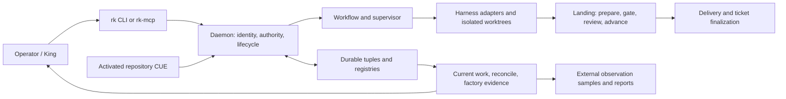

# Current architecture and acceptance map

This is the source navigation map as of 2026-09-05. The native tracker owns
current ticket state; [ROADMAP.md](ROADMAP.md) owns release scope and milestone
exit criteria. Dated reviews and `superpowers/plans/` preserve design history.
Their phase labels and status tables do not supersede current source behavior.

## The operating path

The CLI transports requests and presents results. The daemon owns mutations and
rechecks authenticated identity, repository scope, active policy, generation and
approval state. Displayed commands, saved dashboards and approval labels do not
grant authority. Repository policy is explicit and content-bound at activation;
missing or drifted policy cannot silently enable delivery.

## Module ownership

| Module | Responsibility and useful entrypoints |
| --- | --- |
| `rk-core` | Shared tuple, identity, action, configuration and product contract types. |
| `rk-space` | SQLite tuplespace, durable records and bounded scans/replay. |
| `rk-daemon/server.rs` | RPC identity and dispatch; composition of current-work and factory views. |
| `rk-daemon/supervisor.rs` | Agent generation, process lifecycle, worktrees and delivery bookkeeping. |
| `rk-daemon/workflow_exec.rs` | Durable workflow transitions and composition of resolved steps. |
| `rk-daemon/managed_verification.rs` | Shared execution requests, repository identity/admission, exact proof reuse, cancellation, process-tree cleanup and outcome evidence. Cargo directory serialization is independent of general admission. |
| `rk-daemon/revert.rs` | Durable exact-operation undo, parked revert candidates and retryable registry/ticket/evidence finalization. |
| `rk-daemon/landing.rs` | Persistent candidate queue; gates/review; exact tested target advancement and finalization. Conflict, rework and reviewer-death policy live in adjacent modules. |
| `rk-daemon/tickets.rs` | Canonical ticket identities, dependencies and durable delivery records. |
| `rk-daemon/reconcile*.rs`, `attention.rs`, `authority.rs` | Cross-ledger contradictions and constrained repair decisions. |
| `rk-daemon/king.rs`, `operator_frontier.rs` | Holder-fenced operator sessions, bounded ready frontier and wake/resolve protocol. |
| `rk-daemon/reactor.rs`, `scheduler.rs`, `drain.rs` | Event triggers, scheduled work and capacity-bounded continuous dispatch. |
| `rk-workflow` | CUE workflow/check/policy contracts and resolution. |
| `rk-git` | Git worktrees, merge preparation, compare-and-swap target advancement and repository operations. |
| `rk-harness` | Structured coding-agent adapters, usage and transport signals. |
| `rk-ledger` | Pricing and budget policy. |
| `rk-sync` | Per-actor git-notes synchronization of durable records. |
| `rk-mux` | Optional Herdr watch/attach integration. |
| `rk-cli`, `rk-mcp` | Operator CLI/TUI and five typed local MCP tools; the native CLI also renders saved factory evidence offline. |

Use the module interface that owns the transition. Adding another recovery loop
or another interpretation of an event creates an independent owner that must be
reconciled. Extract modules where callers can shed ordering, cleanup or identity
knowledge; splitting large files alone does not provide that benefit.

## Diagnostics have different questions

| Read | Question |
| --- | --- |
| `rk --json work <repo>` | What is live, ready, actionable, waiting for a decision, or stalled now? |
| `rk --json reconcile <repo>` | Which registry, ticket, worktree and Git facts contradict each other? |
| `rk --json workflow status <id>` | Which workflow transition or gate owns this run? |
| `rk --json factory snapshot --repo <repo>` | What bounded native evidence can a display inspect? |
| `rk --json factory events replay --repo <repo>` | What ordered recent events are available, and is replay truncated? |
| `rk factory render --snapshot snapshot.json --events events.json` | What did saved native evidence show, without contacting a daemon? |
| `rk --json factory scorecards --repo <repo>` | What do structured historical outcomes support, with missing sources preserved? |
| `rk observe report ...` | Did a frozen observation run meet its registered thresholds? |

These are distinct projections. The retired Python triage helper and renderer
were duplicate interpretation/presentation paths, not additional lifecycle owners.
[Factory Foreman](factory-foreman.md) documents their native replacements and
the explicit installed-skill upgrade path.

## Implementation versus acceptance

The active release is R1: a trusted direct-merge foreign repository. R2 covers
protected-branch/forge delivery; R3 covers untrusted tenant isolation. Existing
PR commands or harness adapters do not establish those later release bars.

| Milestone | Evidence and next acceptance requirement |
| --- | --- |
| M0: convergence | Queue recovery, rework/conflict routing, exact targets and generation fencing exist in source. Maintain their integration and restart regressions while fixing remaining projection and recovery seams. |
| M1: foreign tracer | Foreign work has exercised real delivery and exposed failures. A successful individual delivery is narrower evidence than the full fault-injected tracer exit criteria. |
| M2: semantic slimming | Shared managed verification, typed delivery and native saved presentation now have dedicated ownership; see the [seven-item checklist](2026-09-05-usefulness-improvements.md) for source acceptance. Broader milestone acceptance remains governed by the roadmap. |
| M3: supervised pilot | The saved Glossolalia repeat report failed its pre-registered thresholds. Repair and repeat; do not reinterpret discovery value as qualification. |
| M4: unattended week | Requires a passing M3 report, an injected-stall auditor check and the complete seven-day acceptance period. Source tests do not satisfy this gate. |

The M3 report for run `01M1HS3MBHVNN87XKVKC71JZ5D` covers 192,624 seconds
(53.5 hours), 5,690 samples, ending 2026-09-05T00:52:00Z. It records
`passed: false`, a 1,956-second sample gap, 5,254 build mismatch samples, one
duplicate dispatch and no King replacement. The recorded local evidence is
`~/.rat-kingdom-observations/glossolalia-pilot-repeat-2026-09-02/report.json`;
this paragraph is a dated assessment, not live state. Preserve the manifest and
samples and start a fresh run after repairs, following the
[observation runbook](2026-09-02-observation-runs.md).

For source changes, use `mise run verify-full`. Installation, daemon rollover,
live policy acceptance and foreign-pilot acceptance are separate observations;
record the exact build and evidence for each before claiming parity or readiness.
